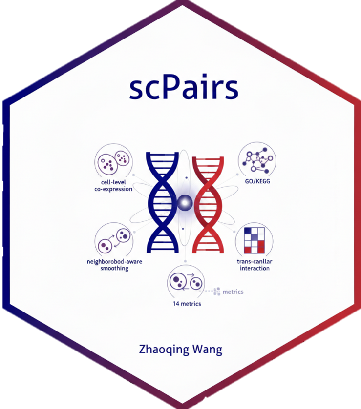

<table>
  <tr>
    <td>
      <h1>scPairs: Identifying Synergistic Gene Pairs in Single-Cell and Spatial Transcriptomics</h1>
      <p>
        <a href="https://github.com/zhaoqing-wang/scPairs/releases"></a>
        <a href="LICENSE"></a>
        <a href="https://www.r-project.org/"></a>
        <a href="https://github.com/zhaoqing-wang"></a>
      </p>
    </td>
    <td width="200">
      
    </td>
  </tr>
</table>

## Overview

**scPairs** identifies cooperative gene pairs in scRNA-seq and spatial transcriptomics data by integrating **14 metrics** across **five evidence layers**: cell-level co-expression, neighbourhood-aware smoothing, prior biological knowledge (GO/KEGG), trans-cellular interaction, and spatial co-variation. Gene pairs are ranked by a composite synergy score with optional permutation-based significance testing.

## Installation

```r
# Install from GitHub
if (!require("devtools")) install.packages("devtools")
devtools::install_github("zhaoqing-wang/scPairs")

# For prior knowledge integration (recommended)
BiocManager::install(c("org.Mm.eg.db", "org.Hs.eg.db", "AnnotationDbi"))
```

**Required:** Seurat (>=4.0), data.table, ggplot2, ggraph, igraph, Matrix, patchwork, tidygraph, tidyr

**Optional:** org.Mm.eg.db, org.Hs.eg.db, AnnotationDbi (prior knowledge), RANN (fast KNN), ggExtra (marginal densities)

## Quick Start

```r
library(scPairs)
library(Seurat)

sce <- readRDS("your_data.rds")
```

### 1. Global Pair Discovery

```r
# All metrics (default)
result <- FindAllPairs(sce, n_top_genes = 1000, top_n = 200)

# Expression metrics only (skip prior knowledge)
result <- FindAllPairs(sce, mode = "expression")

# Prior knowledge only (fast screening)
result <- FindAllPairs(sce, mode = "prior_only", organism = "mouse")

# With permutation testing
result <- FindAllPairs(sce, n_top_genes = 500, n_perm = 999)

# Visualize
PlotPairNetwork(result, top_n = 50)
PlotPairHeatmap(result, top_n = 25)
```

### 2. Query-Centric Partner Search

```r
tp53_partners <- FindGenePairs(sce, gene = "TP53", top_n = 20)
PlotPairNetwork(tp53_partners)
PlotPairDimplot(sce, gene1 = "TP53", gene2 = tp53_partners$pairs$gene2[1])
```

### 3. In-Depth Pair Assessment

```r
assessment <- AssessGenePair(sce, gene1 = "CD8A", gene2 = "CD8B")
assessment

PlotPairSmoothed(sce, gene1 = "CD8A", gene2 = "CD8B")
PlotPairSummary(sce, gene1 = "CD8A", gene2 = "CD8B", result = assessment)

# All visualization functions accept any result class
PlotPairNetwork(assessment)
PlotPairHeatmap(assessment)
```

### 4. Prior Knowledge Integration

```r
# Requires: BiocManager::install(c("org.Mm.eg.db", "AnnotationDbi"))
result <- AssessGenePair(sce, gene1 = "Adora2a", gene2 = "Ido1",
                          organism = "mouse")
PlotPairSynergy(sce, gene1 = "Adora2a", gene2 = "Ido1")

# Custom interaction databases
custom_db <- data.frame(gene1 = c("Adora2a"), gene2 = c("Ido1"))
result <- FindGenePairs(sce, gene = "Adora2a", custom_pairs = custom_db)
```

### 5. Spatial Transcriptomics

Spatial metrics are automatically detected for Visium, MERFISH, Slide-seq, etc.:

```r
result <- FindAllPairs(spatial_obj, n_top_genes = 500)
PlotPairSpatial(spatial_obj, gene1 = "EPCAM", gene2 = "KRT8")
```

## Architecture

### Computation Modes

All three discovery functions (`FindAllPairs`, `FindGenePairs`, `AssessGenePair`) accept a `mode` parameter:

| Mode | Metrics Computed | Use Case |
|------|-----------------|----------|
| `"all"` (default) | All 14 metrics | Full analysis |
| `"expression"` | Co-expression + neighbourhood | No annotation databases |
| `"prior_only"` | Prior knowledge scores only | Fast pathway-based screening |

### Metrics

| Layer | Metrics | Weight |
|-------|---------|--------|
| **Cell-level** | Pearson, Spearman, Biweight, MI, Ratio consistency | 1.0--1.5 |
| **Neighbourhood** | KNN-smoothed cor, Neighbourhood score, Cluster cor, Cross-cell-type, Neighbourhood synergy | 1.2--1.5 |
| **Prior knowledge** | GO/KEGG co-annotation, Pathway bridge score | 1.8--2.0 |
| **Spatial** | Lee's L, Co-location quotient | 1.2--1.5 |

Metrics are rank-normalised to [0, 1] and combined via weighted summation:

```
synergy_score = sum(w_i * rank_norm(metric_i)) / sum(w_i)
```

### Unified Output

All three functions produce results containing a `pairs` data.table with consistent column names (`gene1`, `gene2`, `synergy_score`, `rank`, `confidence`, plus metric columns). Every visualization function accepts any of the three result types interchangeably.

## Functions

| Function | Purpose |
|----------|---------|
| `FindAllPairs()` | Global discovery of synergistic gene pairs |
| `FindGenePairs()` | Find partners for a specific query gene |
| `AssessGenePair()` | Detailed assessment of a single pair |
| `PlotPairNetwork()` | Gene interaction network |
| `PlotPairHeatmap()` | Synergy score heatmap |
| `PlotPairDimplot()` | UMAP co-expression overlay (3-panel) |
| `PlotPairSmoothed()` | Raw + KNN-smoothed UMAP (6-panel) |
| `PlotPairSummary()` | Comprehensive multi-panel figure |
| `PlotPairSpatial()` | Spatial co-expression map (3-panel) |
| `PlotPairCrossType()` | Cross-cell-type interaction heatmap |
| `PlotPairViolin()` | Expression distributions by cluster |
| `PlotPairScatter()` | Gene-gene scatter plot |
| `PlotPairSynergy()` | Prior knowledge + neighbourhood synergy (6-panel) |

## Performance

Vectorised implementations yield 5--20x speedups over naive approaches.

| Scale | Time (no permutation) |
|-------|-----------------------|
| 1000 genes x 5000 cells | ~5--10 s |
| 2000 genes x 10000 cells | ~30--60 s |
| + 999 permutations | add ~2--5 min |

## Citation

```bibtex
@Manual{scPairs,
  title = {scPairs: Identifying Synergistic Gene Pairs in Single-Cell and Spatial Transcriptomics},
  author = {Zhaoqing Wang},
  year = {2026},
  note = {R package version 0.1.6},
  url = {https://github.com/zhaoqing-wang/scPairs},
}
```

## License

MIT License. See [LICENSE](LICENSE).

## Contact

**Author:** Zhaoqing Wang ([ORCID](https://orcid.org/0000-0001-8348-7245)) | **Email:** <zhaoqingwang@mail.sdu.edu.cn> | **Issues:** [GitHub Issues](https://github.com/zhaoqing-wang/scPairs/issues)
