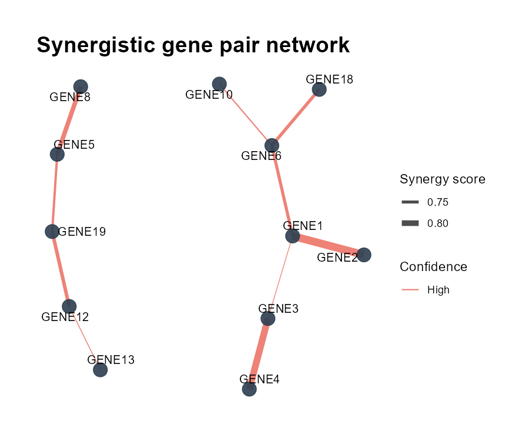
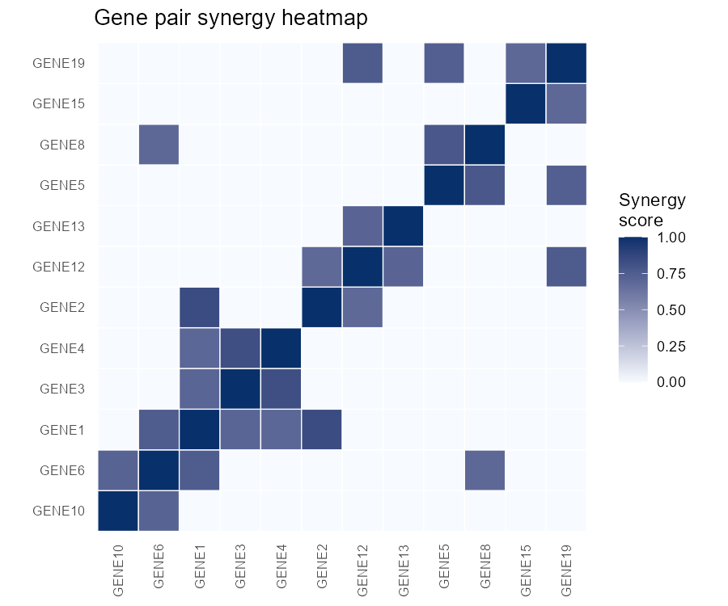
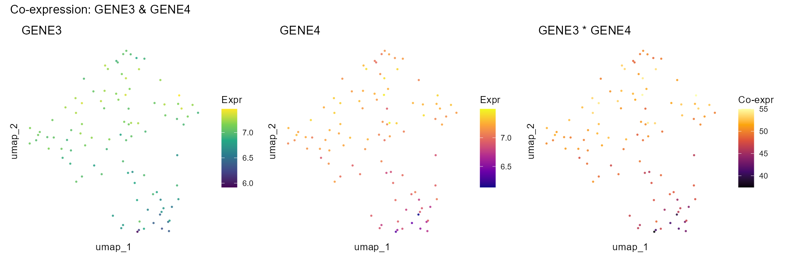
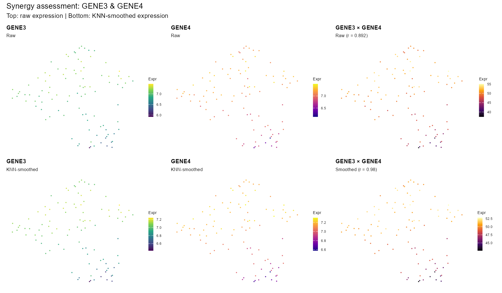
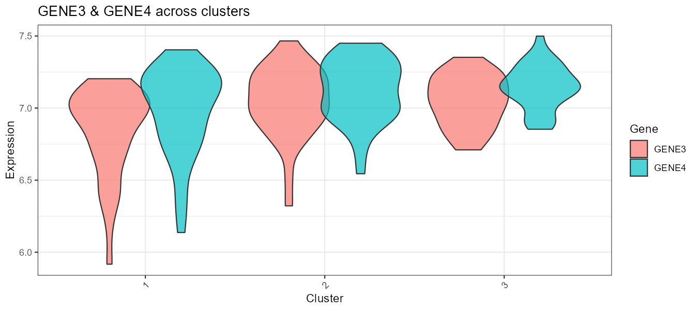

# scPairs: Identifying Synergistic Gene Pairs in Single-Cell and Spatial Transcriptomics

[](https://github.com/zhaoqing-wang/scPairs/releases) [](LICENSE) [](https://www.r-project.org/) [](https://github.com/zhaoqing-wang)

## Overview


**scPairs** is an R package for the systematic identification and multi-evidence evaluation of synergistic gene pairs in single-cell and spatial transcriptomics data. Unlike conventional pairwise co-expression analyses that rely on a single correlation metric, scPairs integrates **14 complementary metrics** across **five orthogonal evidence layers** to compute a composite **synergy score** with optional permutation-based significance testing.

The five evidence layers span cell-level co-expression (Pearson, Spearman, biweight midcorrelation, mutual information, ratio consistency), neighbourhood-aware smoothing (KNN-smoothed correlation, neighbourhood co-expression, cluster pseudo-bulk, cross-cell-type, neighbourhood synergy), prior biological knowledge (GO/KEGG co-annotation Jaccard, pathway bridge score), trans-cellular interaction, and spatial co-variation (Lee's L, co-location quotient). This multi-scale design enables researchers to move beyond simple co-expression towards a comprehensive characterisation of cooperative gene regulation at transcriptomic and spatial resolution.

## Table of Contents

1. [Preparation](#1-preparation)
    - [1.1 Installation](#11-installation)
    - [1.2 Dependencies](#12-dependencies)
2. [Quick Start](#2-quick-start)
    - [2.1 Global Pair Discovery](#21-global-pair-discovery)
    - [2.2 Query-Centric Partner Search](#22-query-centric-partner-search)
    - [2.3 In-Depth Pair Assessment](#23-in-depth-pair-assessment)
    - [2.4 Prior Knowledge & Bridge Gene Network](#24-prior-knowledge--bridge-gene-network)
    - [2.5 Spatial Transcriptomics](#25-spatial-transcriptomics)
3. [Architecture](#3-architecture)
    - [3.1 Computation Modes](#31-computation-modes)
    - [3.2 Five Evidence Layers (14 Metrics)](#32-five-evidence-layers-14-metrics)
    - [3.3 Unified Output Schema](#33-unified-output-schema)
4. [Visualization Gallery](#4-visualization-gallery)
5. [Functions](#5-functions)
    - [5.1 Discovery (3 functions)](#51-discovery-3-functions)
    - [5.2 Visualization (11 functions)](#52-visualization-11-functions)
6. [Built-in Test Dataset](#6-built-in-test-dataset)
7. [Citation](#7-citation)
8. [License](#8-license)
9. [Contact](#9-contact)

---

## 1. Preparation

### 1.1 Installation

```r
# Install from GitHub
if (!require("devtools")) install.packages("devtools")
devtools::install_github("zhaoqing-wang/scPairs")

# Optional: prior knowledge integration (GO/KEGG annotation)
if (!require("BiocManager")) install.packages("BiocManager")
BiocManager::install(c("org.Mm.eg.db", "org.Hs.eg.db", "AnnotationDbi"))
```

<details>
<summary><b>Install missing CRAN dependencies manually</b></summary>

```r
install.packages(c("data.table", "ggplot2", "ggraph", "ggrepel",
                   "igraph", "Matrix", "patchwork", "Seurat",
                   "tidygraph", "tidyr"))
# Optional accelerators and extras
install.packages(c("RANN", "ggExtra", "crayon"))
```

</details>

### 1.2 Dependencies

**Required:** Seurat (≥ 4.0), data.table, ggplot2, ggraph, ggrepel, igraph, Matrix, patchwork, tidygraph, tidyr

**Optional:**

| Package | Purpose |
|---|---|
| `org.Mm.eg.db` / `org.Hs.eg.db` | GO & KEGG prior knowledge (mouse / human) |
| `AnnotationDbi` | Gene annotation infrastructure |
| `RANN` | Fast approximate KNN (10–100× speedup for neighbourhood metrics) |
| `ggExtra` | Marginal density panels in `PlotPairScatter()` |
| `crayon` | Colourised startup message |

---

## 2. Quick Start

```r
library(scPairs)
sce <- readRDS("your_data.rds")  # Seurat object, normalised
```

### 2.1 Global Pair Discovery

```r
# All 14 metrics (default)
result <- FindAllPairs(sce, n_top_genes = 1000, top_n = 200)

# Expression metrics only — no annotation databases required
result <- FindAllPairs(sce, mode = "expression")

# Prior knowledge only — fast pathway-based screening
result <- FindAllPairs(sce, mode = "prior_only", organism = "mouse")

# With permutation testing (empirical p-values)
result <- FindAllPairs(sce, n_top_genes = 500, n_perm = 999)

# Visualise
PlotPairNetwork(result, top_n = 50)
PlotPairHeatmap(result, top_n = 25)
```

### 2.2 Query-Centric Partner Search

```r
tp53_partners <- FindGenePairs(sce, gene = "TP53", top_n = 20)
PlotPairNetwork(tp53_partners)
PlotPairDimplot(sce, gene1 = "TP53", gene2 = tp53_partners$pairs$gene2[1])
```

### 2.3 In-Depth Pair Assessment

```r
assessment <- AssessGenePair(sce, gene1 = "CD8A", gene2 = "CD8B")
print(assessment)                                          # structured summary

PlotPairSmoothed(sce, gene1 = "CD8A", gene2 = "CD8B")    # raw vs KNN-smoothed
PlotPairSummary(sce,  gene1 = "CD8A", gene2 = "CD8B",
                result = assessment)                       # full evidence dashboard

# All visualisation functions accept any result class interchangeably
PlotPairNetwork(assessment)
PlotPairHeatmap(assessment)
```

### 2.4 Prior Knowledge & Bridge Gene Network

```r
# Requires: BiocManager::install(c("org.Mm.eg.db", "AnnotationDbi"))
result <- AssessGenePair(sce, gene1 = "Adora2a", gene2 = "Ido1",
                         organism = "mouse")

# 6-panel synergy dashboard (expression + neighbourhood + prior evidence)
PlotPairSynergy(sce, gene1 = "Adora2a", gene2 = "Ido1")

# Standalone bridge gene network
PlotBridgeNetwork(sce, gene1 = "Adora2a", gene2 = "Ido1",
                  organism = "mouse", top_bridges = 15)

# Custom interaction databases (CellChatDB, CellPhoneDB, SCENIC, etc.)
custom_db <- data.frame(gene1 = c("Adora2a"), gene2 = c("Ido1"))
result <- FindGenePairs(sce, gene = "Adora2a", custom_pairs = custom_db)
```

### 2.5 Spatial Transcriptomics

Spatial metrics are detected and computed automatically for Visium, MERFISH, Slide-seq, and similar modalities:

```r
result <- FindAllPairs(spatial_obj, n_top_genes = 500)   # spatial metrics auto-enabled
PlotPairSpatial(spatial_obj, gene1 = "EPCAM", gene2 = "KRT8")
```

---

## 3. Architecture

### 3.1 Computation Modes

| Mode | Metrics Computed | Dependencies | Use Case |
|---|---|---|---|
| `"all"` (default) | All 14 metrics | All packages | Full multi-evidence analysis |
| `"expression"` | Co-expression + neighbourhood (10) | No annotation DBs | No external databases needed |
| `"prior_only"` | Prior knowledge scores only (2) | org.\*.db, AnnotationDbi | Fast pathway screening |

### 3.2 Five Evidence Layers (14 Metrics)

| Layer | Metrics | Weight |
|---|---|---|
| **Cell-level** (5) | Pearson (`cor_pearson`), Spearman (`cor_spearman`), Biweight midcorrelation (`cor_biweight`), Mutual information (`mi_score`), Ratio consistency (`ratio_consistency`) | 1.0 – 1.5 |
| **Neighbourhood** (5) | KNN-smoothed correlation (`smoothed_cor`), Neighbourhood score (`neighbourhood_score`), Cluster correlation (`cluster_cor`), Cross-cell-type score (`cross_celltype_score`), Neighbourhood synergy (`neighbourhood_synergy`) | 1.2 – 1.5 |
| **Prior knowledge** (2) | GO/KEGG co-annotation Jaccard (`prior_score`), Pathway bridge score (`bridge_score`) | 1.8 – 2.0 |
| **Spatial** (2) | Lee's L (`spatial_lee_L`), Co-location quotient (`spatial_clq`) | 1.2 – 1.5 |

Metrics are rank-normalised to [0, 1] and combined via weighted summation:

$$S = \frac{\sum_{i} w_{i} \cdot R(m_{i})}{\sum_{i} w_{i}}$$

where $S$ denotes `synergy_score` and $R(\cdot)$ denotes rank normalisation (`rank_norm`).

### 3.3 Unified Output Schema

All three workflows produce a `pairs` data.table with consistent columns: `gene1`, `gene2`, `synergy_score`, `rank`, `confidence`, plus all metric columns. Every visualisation function accepts any result class interchangeably.

**Confidence assignment:**

| With permutation p-values | Without p-values (score quantiles) |
|---|---|
| High: `p_adj` < 0.01 | High: ≥ 95th percentile |
| Medium: `p_adj` < 0.05 | Medium: ≥ 80th percentile |
| Low: `p_adj` < 0.10 | Low: ≥ 50th percentile |

---

## 4. Visualization Gallery

The following plots are generated from the built-in `scpairs_testdata` object (100 cells × 20 genes, synthetic co-expression patterns). GENE3 and GENE4 are the injected globally co-expressed pair (Pearson r ≈ 0.89).

### Pair Discovery — Network & Heatmap

| Gene Pair Network | Synergy Score Heatmap |
|:---:|:---:|
|  |  |

*Left: `PlotPairNetwork()` — synergy-weighted interaction graph; node size ∝ connectivity, edge width ∝ synergy score.  
Right: `PlotPairHeatmap()` — pairwise synergy matrix; top-ranked pairs clustered by score.*

### Co-expression — UMAP Overlays

**Raw expression (3-panel):**



*`PlotPairDimplot()` — UMAP coloured by individual gene expression and co-expression product. GENE3 and GENE4 show overlapping high-expression regions, revealing their synergistic co-activation.*

**Raw vs KNN-smoothed (6-panel):**



*`PlotPairSmoothed()` — top row: raw expression; bottom row: KNN-smoothed. Smoothing reduces single-cell noise and clarifies the co-expression domain across the embedding.*

### Expression Distribution & Scatter

| Violin by Cluster | Gene–Gene Scatter |
|:---:|:---:|
|  |  |

*Left: `PlotPairViolin()` — expression distributions of GENE3, GENE4, and their product per cluster.  
Right: `PlotPairScatter()` — cell-level gene–gene scatter coloured by cluster; positive correlation visible across all three groups.*

---

## 5. Functions

### 5.1 Discovery (3 functions)

| Function | Purpose |
|---|---|
| `FindAllPairs()` | Global discovery of synergistic gene pairs across all variable genes |
| `FindGenePairs()` | Find synergistic partners for a specific query gene |
| `AssessGenePair()` | In-depth assessment of a specific gene pair with per-cluster detail |

### 5.2 Visualization (11 functions)

| Function | Input | Purpose |
|---|---|---|
| `PlotPairNetwork()` | Any result class | Synergy-weighted gene interaction network |
| `PlotPairHeatmap()` | Any result class | Synergy score heatmap across top gene pairs |
| `PlotPairDimplot()` | Seurat object | UMAP co-expression overlay (3-panel) |
| `PlotPairSmoothed()` | Seurat object | Raw + KNN-smoothed UMAP expression (6-panel) |
| `PlotPairSummary()` | Seurat object | Comprehensive multi-panel summary figure |
| `PlotPairSpatial()` | Spatial Seurat | Spatial co-expression map (3-panel) |
| `PlotPairCrossType()` | Seurat object | Cross-cell-type interaction heatmap |
| `PlotPairViolin()` | Seurat object | Expression distributions by cluster |
| `PlotPairScatter()` | Seurat object | Gene–gene scatter with optional marginal densities |
| `PlotPairSynergy()` | Seurat object | Multi-evidence synergy dashboard (4-panel) |
| `PlotBridgeNetwork()` | Seurat object | Bridge gene network with pathway-weighted edges |

---

## 6. Built-in Test Dataset

`scpairs_testdata` is a minimal synthetic Seurat object shipped with the package for immediate use in examples and tests:

```r
data(scpairs_testdata)
scpairs_testdata
#> An object of class Seurat
#> 20 features across 100 samples within 1 assay
#> Active assay: RNA (20 features, 20 variable features)
#>  3 layers present: counts, data, scale.data
#>  2 dimensional reductions calculated: pca, umap
```

| Property | Value |
|---|---|
| Genes | GENE1–GENE20 (synthetic) |
| Cells | CELL001–CELL100 |
| Clusters | 3 balanced clusters (`seurat_clusters`) |
| Reductions | PCA (5 components), UMAP (2 dimensions) |
| Co-expression | GENE3/GENE4 globally (r ≈ 0.89); GENE1/GENE2 cluster-1-specific |
| File size | 26 KB (xz-compressed) |

The dataset is generated by `data-raw/make_testdata.R` with `set.seed(7391)` for full reproducibility.

---

## 7. Citation

```
Wang Z (2026). scPairs: Identifying Synergistic Gene Pairs in Single-Cell and
Spatial Transcriptomics. R package version 0.1.8.
https://github.com/zhaoqing-wang/scPairs
```

---

## 8. License

[MIT](https://github.com/zhaoqing-wang/scPairs/blob/main/LICENSE.md)

---

## 9. Contact

**Author:** Zhaoqing Wang ([ORCID](https://orcid.org/0000-0001-8348-7245)) | **Email:** <zhaoqingwang@mail.sdu.edu.cn> | **Issues:** [scPairs Issues](https://github.com/zhaoqing-wang/scPairs/issues)
